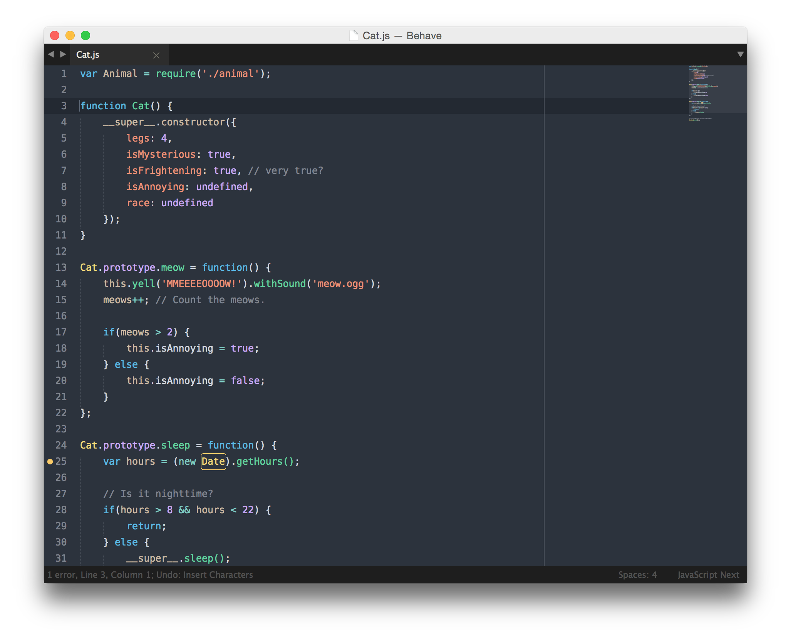

# Behave Theme

A theme that makes you happy like cats on the internet, and Morgan Freeman's sexy voice.

## TAKE MY MONEY!

It's totally free! Just follow the instructions below... here they come...

### TextMate

Simply copy the `.tmTheme` file to `~/Library/Application Support/TextMate/Themes`

### Sublime Text

#### I use Package Control

I like your style. Open your **Command Palette** *(Command + Shift + P)* and search for **"Behave Theme"** to get it from Package Control.

#### I know what I'm doing

Simply

    git clone https://github.com/fnky/behave-theme

into your Package Control folder. You can find that through Sublime Text under `Preferences > Browse Packages...` or the Command Palette and copy the `.tmTheme` to Packages.

## Argh! Something is wrong!

Don't worry, it's not your fault - probably. I'm still working out some better syntax highlight for different languages. But you can help me out!

Simply create a thread in the Issues tab, and explain what the problem is. Even better; you can fork this repository and make your changes in another branch and make a pull request :-)

## I want this for my editor

I'd love to have this theme available for your editor! I'm still working on pushing it to all other editors. However, if you'd like, you could make a pull request with your port of the theme :-)

## I wanna hug you right now

That's sweet of you! You can follow me on Twitter [@chrbp](http://twitter.com/chrbp) - that makes me happy too.
